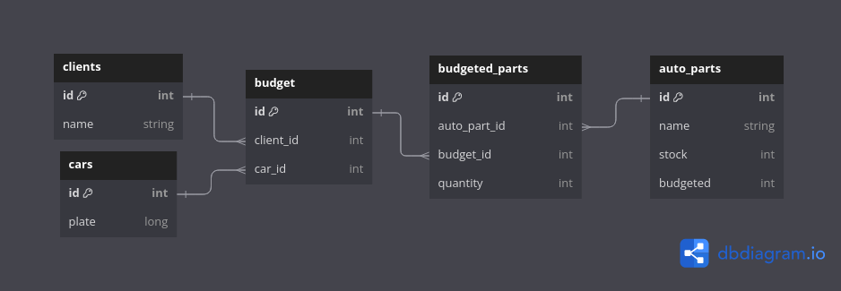

# Stock Manager Api

#### Descrição

Aplicação desenvolvida para lidar com alocação de peças automotivas para orçamentos, foi desenvolvida com:
- .NET 8
- ASP.NET Core
- EntityFramework Core
- PostgreSQL
- Repository Pattern

Utilizando a metodologia Code First para mapear as entidades e seus relacionamentos estabeleci o seguinte diagrama de ER:



###### Imagem criada no [DB diagram](https://dbdiagram.io) script para gerar a imagem está em [aqui](assets/diagram.md)

### Requerimentos

#### docker compose 3.9

para rodar a aplicação em ambiente de desenvolvimento é necessário ter um container de PostgreSQL inciado, para isso pode renomear os ```env-example``` para ```.env```, ou atribuir as credencias da forma que desejar em um arquivo ```.env```

para subir o container de PostgreSQL após popular as variáveis de ambiente nos arquivos .env é só rodar o comando

```bash
docker compose up -d
```

#### depois execute os comandos para
- entrar no diretório stock-manager-api
- restaurar as dependências da api
- executar a migration e popular o banco de dados
- por último executar a aplicação em modo de desenvolvimento

```bash
cd stock-manager-api
dotnet restore
dotnet ef database update
dotnet watch
```

Uma janela do navegador com o resumo do swagger deve aparecer, caso contrário basta seguir para http://localhost:5133/swagger

## Resumo dos Endpoints

<details> 
<summary>
<h2>
 /autoparts
</h2>
</summary>

Rota responsável por gerenciar o recurso AutoPart, pode listar, cadastrar, editar e deletar uma peça

Exemplo de reposta com uma lista de peças
```json
[
  {
    "id": 1,
    "name": "BRACKET-ENGINE MOUNTING",
    "stock": 10,
    "budgeted": 0
  },
[...]
  {
    "id": 5,
    "name": "COLLECTOR-INTAKE MANIFOLD",
    "stock": 10,
    "budgeted": 0
  }
]
```

Exemplo da payload para o método Post

###### a propriedade ```budgeted``` só aceita o valor 0

```json
{
  "name": "INSULATOR",
  "quantity": 12,
  "budgeted": 0
}
```
</details>

<details> 
<summary>
<h2>
 /cars
</h2>
</summary>

Rota responsável por gerenciar o recurso Car, pode listar, cadastrar, editar e deletar um carro

Exemplo de reposta com uma lista de carros
```json
[
  {
    "id": 1,
    "plate": "KLV0553"
  },
  {
    "id": 2,
    "plate": "BLN4551"
  },
  {
    "id": 3,
    "plate": "LBT0505"
  },
  {
    "id": 4,
    "plate": "ASF6752"
  },
  {
    "id": 5,
    "plate": "JNQ7346"
  }
]
```

Exemplo da payload para o método Post

###### a propriedade ```plate``` só aceita cadeia de caracteres que estejam no padrão ```[A-Z]{3}[0-9]{4}```


```json
{
  "plate": "HDG4584"
}

```
</details>

<details> 
<summary>
<h2>
 /clients
</h2>
</summary>

Rota responsável por gerenciar o recurso Client, pode listar, cadastrar, editar e deletar um cliente

Exemplo de reposta com uma lista de clientes
```json
[
  {
    "id": 1,
    "name": "Camila Tristão"
  },
  {
    "id": 2,
    "name": "Teobaldo Albano"
  },
  {
    "id": 3,
    "name": "Ivan Roval"
  },
  {
    "id": 4,
    "name": "Fabricio Eliseu"
  },
  {
    "id": 5,
    "name": "Arnaldo Reynaldo"
  }
]
```

Exemplo da payload para o método Post

###### a propriedade ```name``` só aceita valores que possuam pelo menos 2 caracteres


```json
{
  "name": "Ligia Frederico"
}

```
</details>

<details> 
<summary>
<h2>
 /budgets
</h2>
</summary>

Rota responsável por gerenciar o recurso Budget, pode listar, cadastrar, editar e deletar um orçamento.
Caso não haja estoque suficiente para alocar o orçamento a API aceita a request e responde com código 202(Accepted), já que não vai criar recursos, mas devolve uma mensagem informando o id e nome do produto que falta em estoque para realizar o orçamento

Exemplo de reposta com uma lista de budgets
```json
[
  {
    "id": 1,
    "car": {
      "id": 3,
      "plate": "LBT0505"
    },
    "client": {
      "id": 2,
      "name": "Teobaldo Albano"
    },
    "autoparts": [
      {
        "id": 1,
        "name": "BRACKET-ENGINE MOUNTING",
        "quantity": 3
      }
    ]
  },
  {
    "id": 2,
    "car": {
      "id": 1,
      "plate": "KLV0553"
    },
    "client": {
      "id": 1,
      "name": "Camila Tristão"
    },
    "autoparts": [
      {
        "id": 1,
        "name": "BRACKET-ENGINE MOUNTING",
        "quantity": 1
      },
      {
        "id": 5,
        "name": "COLLECTOR-INTAKE MANIFOLD",
        "quantity": 1
      }
    ]
  }
]
```

Exemplo da payload para o método Post


```json
{
  "client": {
    "id": 2,
    "name": "Teobaldo Albano"
  },
  "car": {
    "id": 3,
    "plate": "LBT0505"
  },
  "parts": [
    {
      "id": 1,
      "name": "BRACKET-ENGINE MOUNTING",
      "quantity": 3
    }
  ]
}

```
</details>